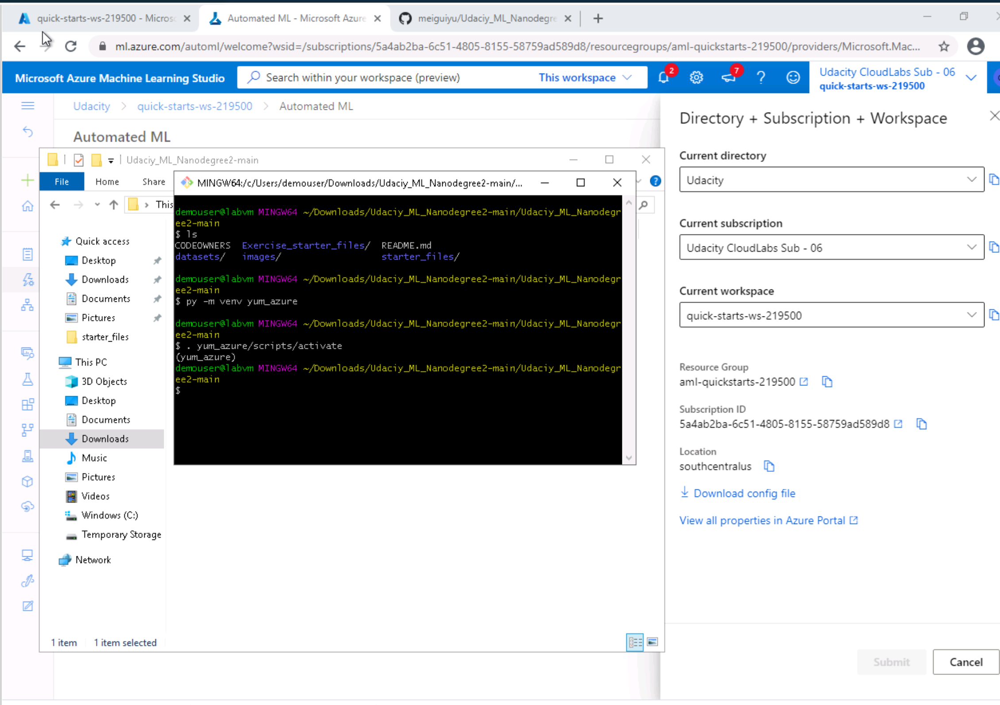

# Overview of the project

# Architectural Diagram

Figure 1: Architectural Diagram

# Main steps
## Step 1: Authentication
I skip this part because I am using Udacity provided lab.

## Step 2: Automated ML Experiment
In this step, I built an AutoML experiment using the bank marketing data. 
Figure 2-1 shows the bank marketing dataset has been uploaded to the Azure ML Studio and is available for model training use.

Figure 2-1: Bank Marketing Data

Figure 2-2 shows the created AutoML experiment has completed.

Figure 2-2: AutoML Experiment Status

Figure 2-3 shows the best model from the AutoML experiment.

Figure 2-3: Best Model

## Step 3: Deploy the Best Model
Figure 3 shows the best model has been deployed in the Azure AutoML Studio.

Figure 3: Deployed Best Model

## Step 4: Enable Application Insights
Figure 4-1 shows the application insights has been enabled for the deployed model so the logging can be tracked.

Figure 3: Application Insights Enabled

Figure 4-2 shows the logs has been captured for the deployed model.

Figure 3: Captured Logs

## Step 5: Swagger Documentation
Figure 5 shows the swagger documentation.

Figure 3: Captured Logs

## Step 6: Consume Model Endpoints
## Step 7: Create, Publish and Consume a Pipeline

# Future improvement
# Screencast link
<a href="https://www.google.com/" target="_blank">Screencast video</a>

# Dataset
https://automlsamplenotebookdata.blob.core.windows.net/automl-sample-notebook-data/bankmarketing_train.csv

