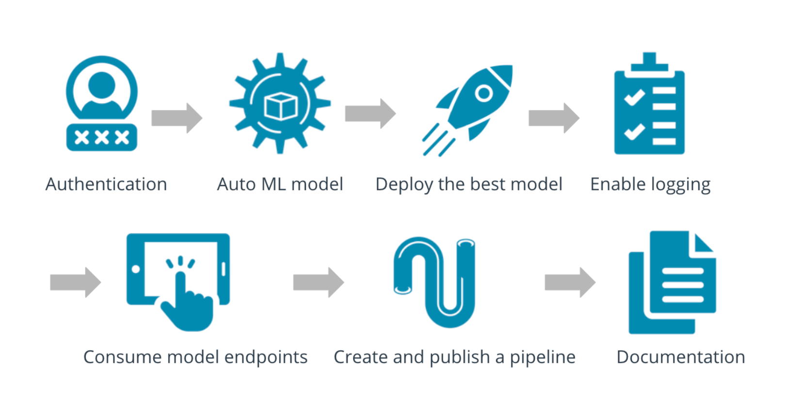
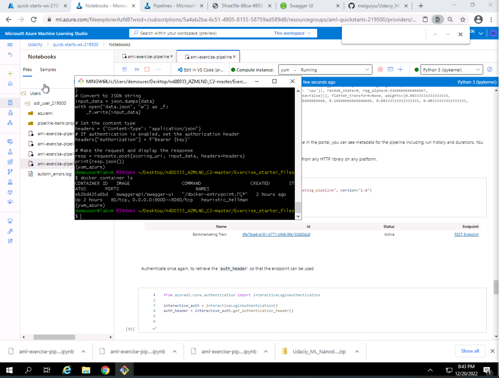
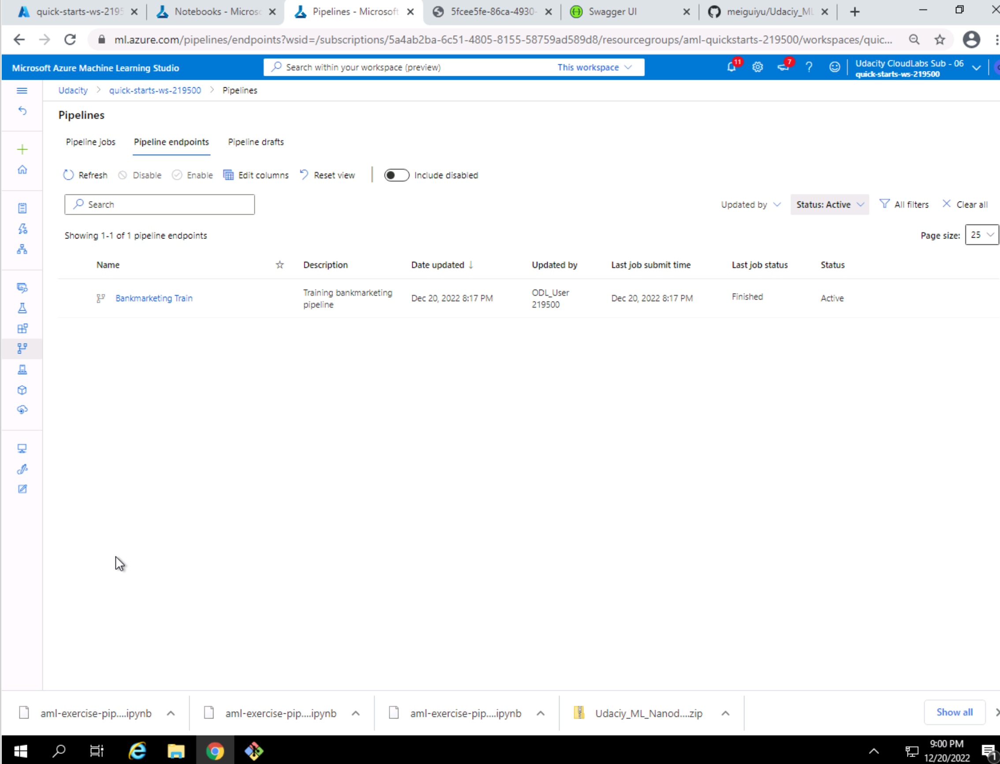

# Overview of the project

# Architectural Diagram

Figure 1: Architectural Diagram

# Main steps
## Step 1: Authentication
I skip this part because I am using Udacity provided lab.

## Step 2: Automated ML Experiment
In this step, I built an AutoML experiment using the bank marketing data. 
Figure 2-1 shows the bank marketing dataset has been uploaded to the Azure ML Studio and is available for model training use.

Figure 2-1: Bank Marketing Data

Figure 2-2 shows I created an AutoML experiment using the bank marketing data set and it has completed.

Figure 2-2: AutoML Experiment Status

Figure 2-3 shows the best model is able to be retrieved from the AutoML experiment.

Figure 2-3: Best Model

## Step 3: Deploy the Best Model
In this step, I deployed the best AutoML model.
Figure 3-1 shows the best model has been displayed with explanation enabled in the Azure AutoML Studio.

Figure 3-1: Best Model

Figure 3-2 shows the best model is being deployed using ACI with authentication enabled in the Azure AutoML Studio.

Figure 3-2: Deploying Best Model

Figure 3-3 and 3-4 show the best model has been deployed successfully in the Azure AutoML Studio.

Figure 3-3: Deployed Best Model1

Figure 3-4: Deployed Best Model2

## Step 4: Enable Application Insights
In this step, I enabled the logging for the deployed model.
Figure 4-2 shows the application insights has been enabled for the deployed model so the logging can be tracked.

Figure 4-2: Application Insights Enabled

Figure 4-3 and 4-4 show the logs has been captured for the deployed model.

Figure 4-3: Captured Logs1

Figure 4-4: Captured Logs2

## Step 5: Swagger Documentation
In this part, I set up swagger to consume the model endpoint.
Figure 5-2 shows the swagger docker is up and running.

Figure 5-2: Swagger docker

Figure 5-4 and 5-5 show the swagger.sh and serve.py files are running.

Figure 5-4: API service1

Figure 5-5: API service2

Figure 5-6 shows the API content for the deployed model.

Figure 5-6: API content

## Step 6: Consume Model Endpoints
In this step, I used swagger to consume the model endpoint.
Figure 6-2 shows the API endpoint and primary are updated using the deployed model.

Figure 6-2: Endpoint.py

Figure 6-3 shows the returned response from the endpoint using a sample intput payload.

Figure 6-3: Consume model endpoint

## Step 7: Create, Publish and Consume a Pipeline
In this part, I created, published, and consumed a pipeline for the created experiment.
Figure 7-1 and 7-2 show a pipeline has been created for the yum-experiment in the jupyter notebook and has been running successfully.

Figure 7-1: Create a pipeline1

Figure 7-2: Create a pipeline2

Figure 7-4 and 7-5 show the pipleline has been published successfully with an active status.

Figure 7-4: Published pipeline1

Figure 7-5: Published pipeline2

# Future improvement
# Screencast link
<a href="https://www.youtube.com/watch?v=ukJf9IzUs34" target="_blank">Screencast video</a>

# Dataset
https://automlsamplenotebookdata.blob.core.windows.net/automl-sample-notebook-data/bankmarketing_train.csv

