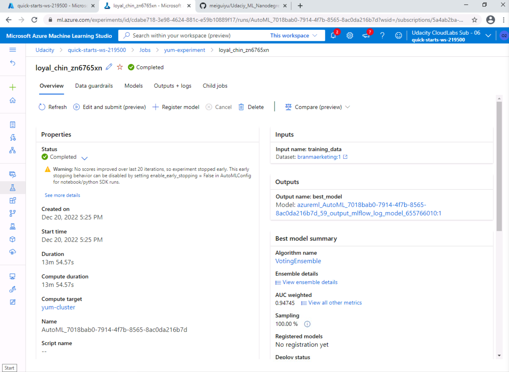

# Overview of the project

# Architectural Diagram

Figure 1: Architectural Diagram

# Main steps
## Step 1: Authentication
I skip this part because I am using Udacity provided lab.

## Step 2: Automated ML Experiment
In this step, I built an AutoML experiment using the bank marketing data.

Figure 2-1: Architectural Diagram

Figure 2-2: Architectural Diagram

Figure 2-3: Architectural Diagram

## Step 3:
## Step 4:
## Step 5:
## Step 6:
## Step 7:

# Future improvement
# Screencast link
<a href="https://www.google.com/" target="_blank">Screencast video</a>

# Dataset
https://automlsamplenotebookdata.blob.core.windows.net/automl-sample-notebook-data/bankmarketing_train.csv

