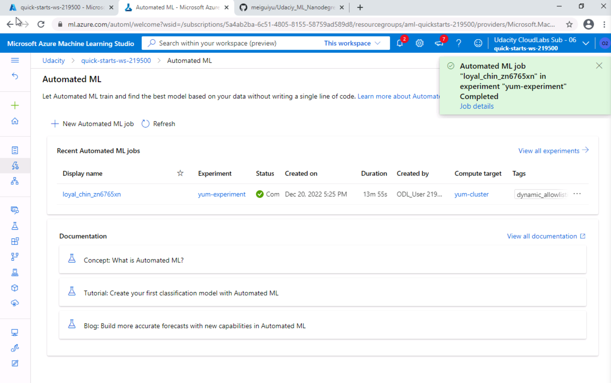
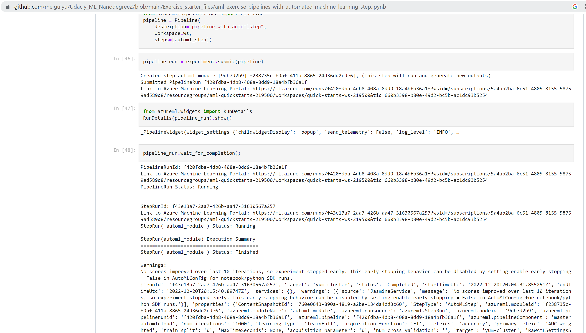

# Overview of the project
In this project, we are going to use the bank marketing data set to build and AutoML experiment to recrieve the best model.
Then we deploy this AutoML model using ACI and with key-board authentication enabled. Then we enable the applicaiton insgits for logging. 
Then we use swaggger to consume the model endpoint. Finally, we build a pipeline for this experiment then pushlish it and consume it.

# Architectural Diagram

*Figure 1: Architectural Diagram*

# Main steps
## Step 1: Authentication
I skip this part because I am using Udacity provided lab.

## Step 2: Automated ML Experiment
In this step, I built an AutoML experiment using the bank marketing data. 
Figure 2-1 shows the bank marketing dataset has been uploaded to the Azure ML Studio and is available for model training use.
*Figure 2-1: Bank Marketing Data*

Figure 2-2 shows I created an AutoML experiment using the bank marketing data set and it has completed.
*Figure 2-2: AutoML Experiment Status*

Figure 2-3 shows the best model is able to be retrieved from the AutoML experiment.
*Figure 2-3: Best Model*

## Step 3: Deploy the Best Model
In this step, I deployed the best AutoML model.

Figure 3-1 shows the best model has been displayed with explanation enabled in the Azure AutoML Studio.
*Figure 3-1: Best Model*

Figure 3-2 shows the best model is being deployed using ACI with authentication enabled in the Azure AutoML Studio.
*Figure 3-2: Deploying Best Model*

Figure 3-3 and 3-4 show the best model has been deployed successfully in the Azure AutoML Studio.
*Figure 3-3: Deployed Best Model1*

*Figure 3-4: Deployed Best Model2*

## Step 4: Enable Application Insights
In this step, I enabled the logging for the deployed model.
Figure 4-2 shows the application insights has been enabled for the deployed model so the logging can be tracked.
*Figure 4-2: Application Insights Enabled*

Figure 4-3 and 4-4 show the logs has been captured for the deployed model.
*Figure 4-3: Captured Logs1*

*Figure 4-4: Captured Logs2*

## Step 5: Swagger Documentation
In this part, I set up swagger to consume the model endpoint.
Figure 5-2 shows the swagger docker is up and running.
*Figure 5-2: Swagger docker*

Figure 5-4 and 5-5 show the swagger.sh and serve.py files are running.
*Figure 5-4: API service1*

*Figure 5-5: API service2*

Figure 5-6 shows the API content for the deployed model.
*Figure 5-6: API content*

## Step 6: Consume Model Endpoints
In this step, I used swagger to consume the model endpoint.
Figure 6-2 shows the API endpoint and primary are updated using the deployed model.
*Figure 6-2: Endpoint.py*

Figure 6-3 shows the returned response from the endpoint using a sample intput payload.
*Figure 6-3: Consume model endpoint*

## Step 7: Create, Publish and Consume a Pipeline
In this part, I created, published, and consumed a pipeline for the created experiment.
Figure 7-1 and 7-2 show a pipeline has been created for the yum-experiment in the jupyter notebook and has been running successfully.
*Figure 7-1: Create a pipeline1*

*Figure 7-2: Create a pipeline2*

Figure 7-4 and 7-5 show the pipleline has been published successfully with an active status.
*Figure 7-4: Published pipeline1*

*Figure 7-5: Published pipeline2*

# Future improvement
# Screencast link
<a href="https://www.youtube.com/watch?v=ukJf9IzUs34" target="_blank">Screencast video</a>

# Dataset
https://automlsamplenotebookdata.blob.core.windows.net/automl-sample-notebook-data/bankmarketing_train.csv

